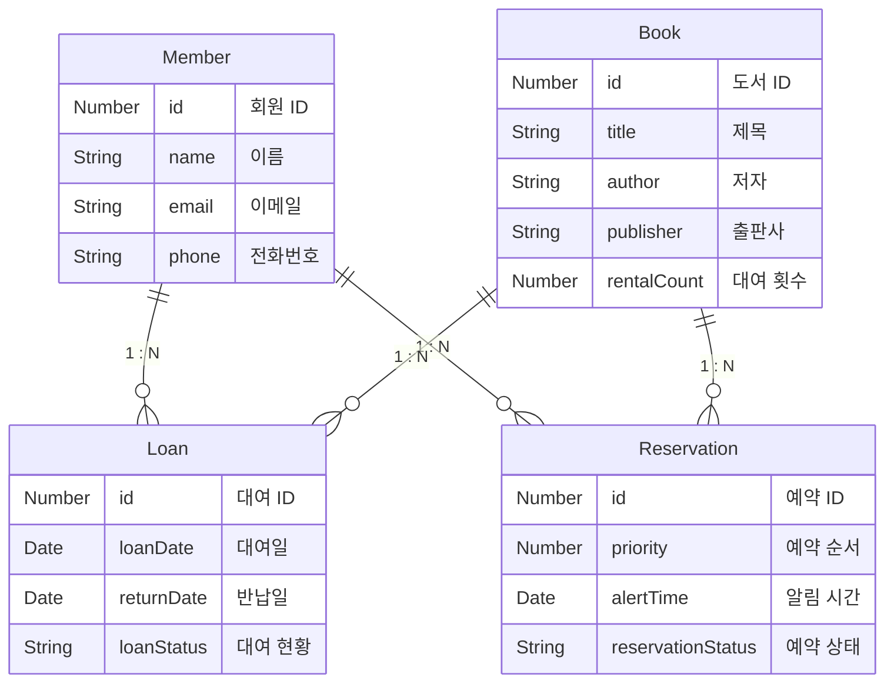

# 도서 대여 관리 시스템

#### 프로젝트 설명
> 이 프로젝트는 JPA 성능 최적화 학습을 위한 프로젝트입니다.

사용자(User), 도서(Book), 대여(Loan) 엔티티를 중심으로 기본적인 CRUD 기능을 제공하며 성능 최적화 및 테스트 코드를 중점적으로 다룹니다.

#### 기술 스택
- **Open JDK**: 17  
- **Spring Boot**: 3.3.5  
- **Database**: H2 Database (테스트 환경용)  
- **Build Tool**: Gradle  
- **Persistence**: 
  - **Spring Data JPA**: 기본 CRUD.
  - **QueryDsl**: 동적 쿼리 생성 및 복잡한 조건 기반 데이터 처리.
  - **MyBatis**: SQL 매퍼로 활용, 복잡한 SQL 쿼리 처리 및 성능 최적화.
  - **통합 환경**: JPA를 기본 데이터 접근 계층으로 사용하며, 복잡한 SQL 작업이 필요한 경우 MyBatis를 활용.
- **Testing**: JUnit5 & Mockito  
- **API Documentation**: Spring REST Docs
- **CI**: GitHub Actions ( PR 시 자동 테스트 - 코드 품질 검증 )

#### 주요 엔티티 구조

#### 주요 요구 사항
- **도서 검색**: 도서 제목, 저자, 출판사 등을 기준으로 검색
- **사용자 검색**: 사용자 이름 또는 이메일을 기준으로 검색
- **대여 및 반납**: 도서 대여 및 반납 처리
- **예약 시스템**: 대여 중인 책을 예약 할 수 있다.
- **대여 내역 조회**: 사용자별 대여 이력 확인
- **대여 순위 조회**: 도서 대여 횟수 기준으로 순위 조회
- **API 문서 작성**: REST API에 대한 문서화 제공

#### 추가적인 성과
- **테스트 코드 작성** : 코드 커버리지 100% 달성
- **쿼리 최적화** : 대여 내역 조회 시 1 : N 관계의 지연 로딩으로 발생하는 N + 1 문제를 Batch Size 설정을 통해 쿼리 실행 횟수를 1+1로 최적화
